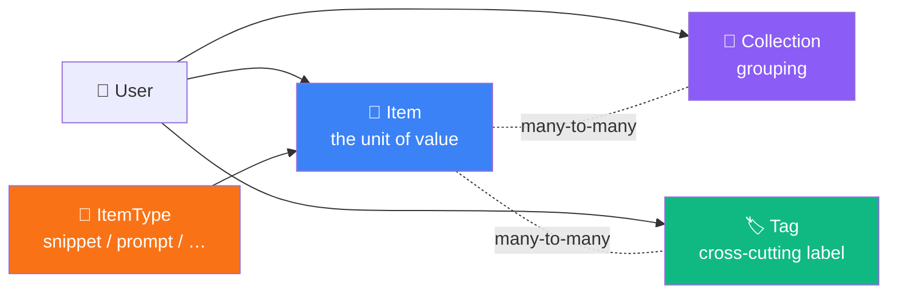
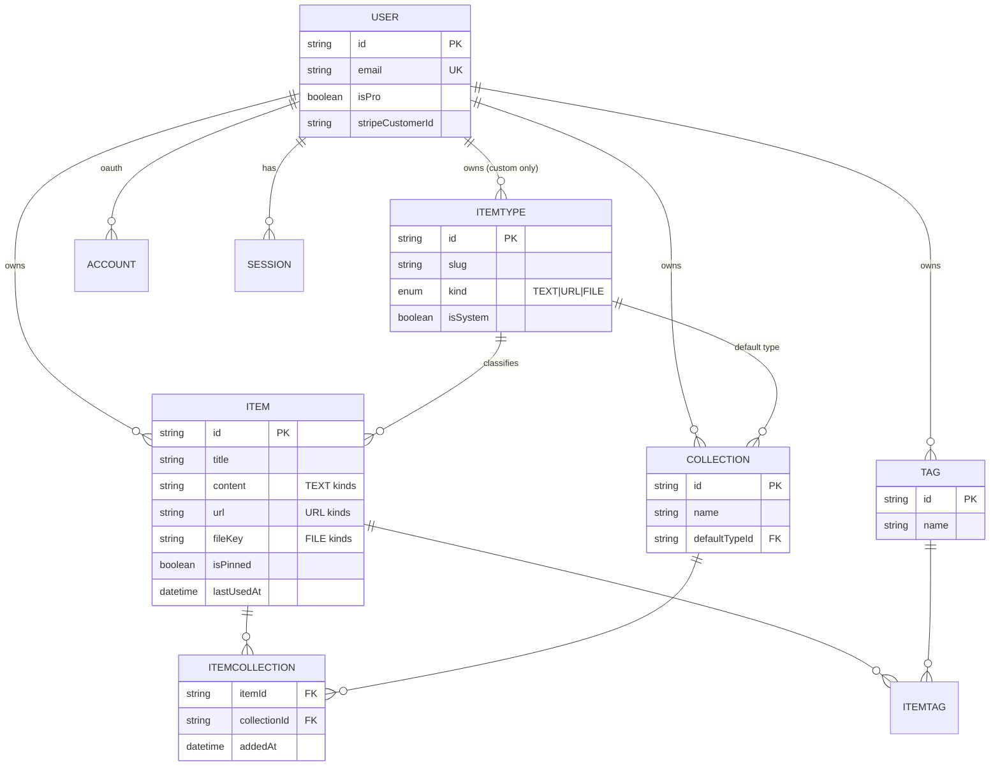
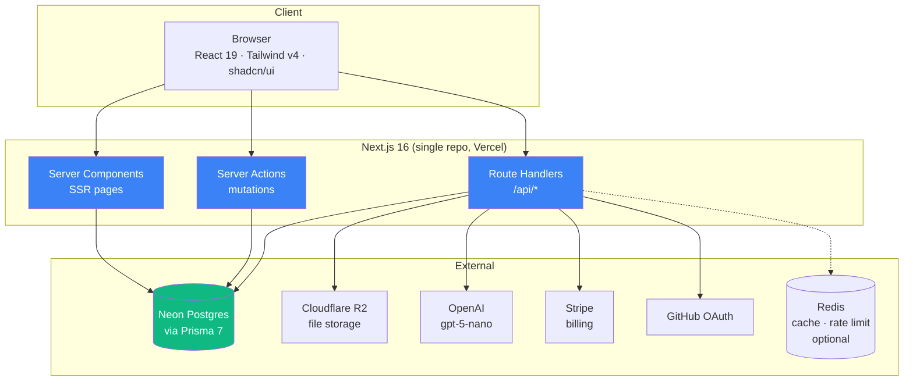
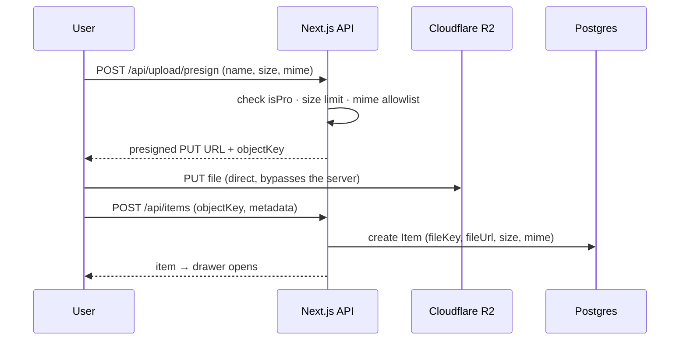
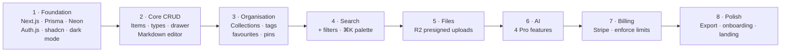

# DevShelf — Project Overview

> One fast, searchable, AI-enhanced shelf for everything a developer keeps lying around: snippets, prompts, commands, notes, links, and files.

| | |
|---|---|
| **Product name** | DevShelf |
| **Type** | Freemium SaaS (web) |
| **Stack** | Next.js 16 · React 19 · TypeScript · Prisma 7 · Neon Postgres · Auth.js v5 · Tailwind v4 · shadcn/ui |
| **Status** | Planning / pre-build |
| **Last updated** | July 30, 2026 |

> **Naming note:** the original notes used both "DevShelf" and "DevStash". This document standardises on **DevShelf** throughout — search/replace `DevStash` anywhere it survives in code, copy, or repo names.

---

## 1. Problem

Developers keep their essentials scattered across a dozen places:

| Asset | Where it usually lives |
|---|---|
| Code snippets | VS Code snippets, Notion, gists |
| AI prompts | Chat histories, sticky notes |
| Context files | Buried inside individual projects |
| Useful links | Browser bookmarks |
| Docs & notes | Random folders |
| Shell commands | `.txt` files, `~/.bash_history` |
| Boilerplates | GitHub gists |

The cost is context switching, lost knowledge, and inconsistent workflows. DevShelf consolidates all of it into a single searchable hub with AI on top.

**Positioning in one line:** *Raycast-fast capture, Notion-flexible organisation, purpose-built for developer knowledge.*

---

## 2. Users

| Persona | Primary need | What they store |
|---|---|---|
| 🧑‍💻 **Everyday Developer** | Grab things fast | Snippets, commands, links |
| 🤖 **AI-first Developer** | Reuse what works | Prompts, system messages, context files, workflows |
| 🎓 **Content Creator / Educator** | Reference while teaching | Code blocks, explanations, course notes |
| 🏗️ **Full-stack Builder** | Avoid rewriting the same thing | Patterns, boilerplates, API examples |

---

## 3. Core Concepts

Three primitives. Everything else hangs off them.



- **Item** — a single saved thing. Always has exactly one **ItemType**.
- **ItemType** — defines the item's *kind* (text / URL / file), its icon, and its colour. Seven system types ship out of the box and are immutable; custom types come later (Pro).
- **Collection** — a user-defined grouping. An item can live in **many** collections (a React snippet can be in both *React Patterns* and *Interview Prep*).
- **Tag** — lightweight, cross-cutting, per-user labels.

---

## 4. Item Types

| Type | Kind | Colour | Icon (lucide) | Route | Plan |
|---|---|---|---|---|---|
| Snippet | `TEXT` | `#3b82f6` 🔵 blue | `Code` | `/items/snippets` | Free |
| Prompt | `TEXT` | `#8b5cf6` 🟣 purple | `Sparkles` | `/items/prompts` | Free |
| Note | `TEXT` | `#fde047` 🟡 yellow | `StickyNote` | `/items/notes` | Free |
| Command | `TEXT` | `#f97316` 🟠 orange | `Terminal` | `/items/commands` | Free |
| Link | `URL` | `#10b981` 🟢 emerald | `Link` | `/items/links` | Free |
| File | `FILE` | `#6b7280` ⚫ gray | `File` | `/items/files` | **Pro** |
| Image | `FILE` | `#ec4899` 🩷 pink | `Image` | `/items/images` | **Pro** |

**Kinds** determine which fields are used and which editor renders:

| Kind | Populated fields | Editor |
|---|---|---|
| `TEXT` | `content` | Markdown / code editor with syntax highlighting |
| `URL` | `url` (+ optional `content` for notes) | URL input + metadata preview |
| `FILE` | `fileKey`, `fileUrl`, `fileName`, `fileSize`, `mimeType` | Dropzone uploader |

> **Design decision:** `kind` belongs on `ItemType`, not on `Item`. The original notes had `contentType` on the item; deriving it from the type removes a whole class of invalid states (e.g. a "snippet" with a `fileUrl`). Custom types later just pick a kind.

Colours are declared once as CSS variables so cards, borders, badges, and sidebar dots all stay in sync:

```css
/* app/globals.css — Tailwind v4 @theme */
@theme {
  --color-type-snippet: #3b82f6;
  --color-type-prompt:  #8b5cf6;
  --color-type-note:    #fde047;
  --color-type-command: #f97316;
  --color-type-link:    #10b981;
  --color-type-file:    #6b7280;
  --color-type-image:   #ec4899;
}
```

---

## 5. Features

### A. Items
- Create, edit, delete, duplicate
- Quick-create and quick-view in a **drawer** (never a full page navigation)
- Markdown editor for text kinds, with syntax highlighting and language selection
- Import code from a local file into a text item
- One-click copy to clipboard
- Pin to top · favourite · recently used

### B. Collections
- Any mix of item types in one collection
- Add / remove an item to/from multiple collections
- From an item, see every collection it belongs to
- Favourite a collection
- `defaultTypeId` drives the card colour of an empty collection

### C. Search
Across **title · content · tags · type**, with filters for collection, type, tag, and favourites.

> **Implementation decision needed.** Start with Postgres `ILIKE` + trigram (`pg_trgm`) — simple, good enough to launch. Move to a generated `tsvector` column with a GIN index when content volume justifies it. Both are migration-only changes; see §10.

### D. Authentication
- Email + password (credentials, hashed with argon2/bcrypt)
- GitHub OAuth
- Auth.js (NextAuth) v5, Prisma adapter, JWT sessions

### E. Quality of life
- Dark mode by default, light mode optional
- Export data (JSON / ZIP) — Pro
- Loading skeletons, toasts, optimistic updates
- Keyboard-first: `⌘K` command palette, `C` to create, `/` to search

### F. AI (Pro)

| Feature | Input | Output |
|---|---|---|
| Auto-tag suggestions | title + content | 3–5 suggested tags, user accepts/rejects |
| Summarise | long content | 1–2 sentence description → `description` field |
| Explain this code | snippet + language | Markdown explanation in the drawer |
| Prompt optimizer | prompt item | Rewritten, improved prompt |

Model: **OpenAI `gpt-5-nano`**. All calls run server-side through `/api/ai/*` routes — the key never reaches the client. Rate-limit per user and log token spend from day one; AI is the only cost that scales with usage.

---

## 6. Data Model

### ERD



### Prisma schema

```prisma
// prisma/schema.prisma
// Prisma 7 — ESM-only, TS query compiler, generated client lives in src/, not node_modules.

generator client {
  provider      = "prisma-client"
  output        = "../src/generated/prisma"
  compilerBuild = "fast" // "small" if bundle size on edge/serverless matters more
}

datasource db {
  provider = "postgresql"
  url      = env("DATABASE_URL")
}

enum ItemKind {
  TEXT
  URL
  FILE
}

// ─────────────────────────────────────────────
// Auth (Auth.js v5 + Prisma adapter)
// ─────────────────────────────────────────────

model User {
  id            String    @id @default(cuid())
  name          String?
  email         String    @unique
  emailVerified DateTime?
  image         String?
  passwordHash  String? // null for OAuth-only accounts

  // Billing
  isPro                  Boolean   @default(false)
  stripeCustomerId       String?   @unique
  stripeSubscriptionId   String?   @unique
  stripePriceId          String?
  stripeCurrentPeriodEnd DateTime?

  accounts    Account[]
  sessions    Session[]
  items       Item[]
  collections Collection[]
  tags        Tag[]
  itemTypes   ItemType[] // custom types only

  createdAt DateTime @default(now())
  updatedAt DateTime @updatedAt
}

model Account {
  id                String  @id @default(cuid())
  userId            String
  type              String
  provider          String
  providerAccountId String
  refresh_token     String?
  access_token      String?
  expires_at        Int?
  token_type        String?
  scope             String?
  id_token          String?
  session_state     String?

  user User @relation(fields: [userId], references: [id], onDelete: Cascade)

  @@unique([provider, providerAccountId])
  @@index([userId])
}

model Session {
  id           String   @id @default(cuid())
  sessionToken String   @unique
  userId       String
  expires      DateTime

  user User @relation(fields: [userId], references: [id], onDelete: Cascade)

  @@index([userId])
}

model VerificationToken {
  identifier String
  token      String   @unique
  expires    DateTime

  @@unique([identifier, token])
}

// ─────────────────────────────────────────────
// Core domain
// ─────────────────────────────────────────────

model ItemType {
  id       String   @id @default(cuid())
  name     String // "Snippet"
  slug     String // "snippets" → /items/snippets
  kind     ItemKind @default(TEXT)
  icon     String // lucide icon name, e.g. "Code"
  color    String // hex, e.g. "#3b82f6"
  isSystem Boolean  @default(false)
  isPro    Boolean  @default(false) // file + image

  userId String? // null for the 7 system types
  user   User?   @relation(fields: [userId], references: [id], onDelete: Cascade)

  items                 Item[]
  defaultForCollections Collection[] @relation("CollectionDefaultType")

  createdAt DateTime @default(now())

  @@unique([userId, slug]) // see migration note below re: system types
  @@index([userId])
}

model Item {
  id          String  @id @default(cuid())
  title       String
  description String? // short blurb; AI summary can fill this

  // TEXT kinds
  content  String? @db.Text
  language String? // syntax highlighting hint: "tsx", "bash", …

  // URL kinds
  url String?

  // FILE kinds (Cloudflare R2)
  fileKey  String? // object key — REQUIRED to delete from the bucket
  fileUrl  String?
  fileName String?
  fileSize Int? // bytes
  mimeType String?

  isFavorite Boolean   @default(false)
  isPinned   Boolean   @default(false)
  lastUsedAt DateTime? // powers "Recently used"

  userId     String
  itemTypeId String

  user        User             @relation(fields: [userId], references: [id], onDelete: Cascade)
  itemType    ItemType         @relation(fields: [itemTypeId], references: [id], onDelete: Restrict)
  collections ItemCollection[]
  tags        ItemTag[]

  createdAt DateTime @default(now())
  updatedAt DateTime @updatedAt

  @@index([userId, updatedAt(sort: Desc)])
  @@index([userId, itemTypeId])
  @@index([userId, lastUsedAt(sort: Desc)])
  @@index([userId, isPinned])
}

model Collection {
  id          String  @id @default(cuid())
  name        String
  description String?
  isFavorite  Boolean @default(false)

  userId        String
  defaultTypeId String? // colours the card while the collection is empty

  user        User             @relation(fields: [userId], references: [id], onDelete: Cascade)
  defaultType ItemType?        @relation("CollectionDefaultType", fields: [defaultTypeId], references: [id], onDelete: SetNull)
  items       ItemCollection[]

  createdAt DateTime @default(now())
  updatedAt DateTime @updatedAt

  @@unique([userId, name])
  @@index([userId, updatedAt(sort: Desc)])
}

model ItemCollection {
  itemId       String
  collectionId String
  addedAt      DateTime @default(now())

  item       Item       @relation(fields: [itemId], references: [id], onDelete: Cascade)
  collection Collection @relation(fields: [collectionId], references: [id], onDelete: Cascade)

  @@id([itemId, collectionId])
  @@index([collectionId, addedAt(sort: Desc)])
}

model Tag {
  id   String @id @default(cuid())
  name String

  userId String
  user   User   @relation(fields: [userId], references: [id], onDelete: Cascade)

  items ItemTag[]

  createdAt DateTime @default(now())

  @@unique([userId, name]) // tags are per-user, not global
  @@index([userId])
}

model ItemTag {
  itemId String
  tagId  String

  item Item @relation(fields: [itemId], references: [id], onDelete: Cascade)
  tag  Tag  @relation(fields: [tagId], references: [id], onDelete: Cascade)

  @@id([itemId, tagId])
  @@index([tagId])
}
```

### Changes made to the original sketch, and why

| Change | Reason |
|---|---|
| `contentType` moved off `Item` → `kind` on `ItemType` | An item's shape is a property of its type. Kills invalid states. |
| Added `ItemType.slug` | The spec calls for `/items/snippets`; slug is what makes that route work. |
| Added `ItemType.isPro` | File/image gating becomes data, not a hardcoded `if`. |
| Added `Item.fileKey` | You cannot delete an R2 object from a public URL alone. Easy to miss until cleanup breaks. |
| Added `Item.mimeType` | Needed to render images vs. offer download, and to validate uploads. |
| Added `Item.lastUsedAt` | "Recently used" was in the feature list with no field to back it. `updatedAt` is not the same thing — copying an item isn't editing it. |
| `Tag` scoped to a user + `ItemTag` join table | Global tags leak one user's vocabulary into another's autocomplete. |
| `@@unique([userId, name])` on Collection and Tag | Prevents duplicate "React Patterns" collections. |
| Explicit `onDelete` on every relation | Deleting a user should cascade; deleting an ItemType should be *blocked* while items reference it. |
| Composite indexes on `userId` + sort column | Every list query is "this user's items, sorted by X". |

> ⚠️ **Postgres NULL gotcha:** `@@unique([userId, slug])` will *not* enforce uniqueness across the seven system types, because Postgres treats each `NULL` `userId` as distinct. Add a partial index by hand in the migration:
> ```sql
> CREATE UNIQUE INDEX "ItemType_system_slug_key"
>   ON "ItemType" ("slug") WHERE "userId" IS NULL;
> ```

---

## 7. Architecture



**Where logic lives**

| Concern | Home |
|---|---|
| Page data fetching | Server Components, direct Prisma calls |
| Create / update / delete | Server Actions (`revalidatePath` after) |
| File uploads | Route handler issuing a **presigned R2 URL**; the browser uploads directly, then reports the key back |
| AI calls | Route handlers only — key stays server-side |
| Stripe webhooks | `/api/stripe/webhook`, raw-body, signature-verified |
| Plan limit enforcement | A single server-side `assertCanCreate(user, resource)` helper. Never trust the client. |

### Upload flow



---

## 8. Routes

### Pages

| Route | Purpose |
|---|---|
| `/` | Marketing landing (unauth) |
| `/login`, `/register` | Auth |
| `/dashboard` | Collection card grid + items below |
| `/items` | All items |
| `/items/[typeSlug]` | Items of one type — `/items/snippets`, `/items/prompts`, … |
| `/collections` | All collections |
| `/collections/[id]` | One collection's items |
| `/search?q=` | Full search with filters |
| `/favorites`, `/recent` | Saved views |
| `/settings` | Profile, appearance, export |
| `/settings/billing` | Stripe portal |

> **Drawer routing:** open items via a search param — `/items/snippets?item=abc123`. The URL stays shareable and the back button behaves, while the drawer renders over the current list. Parallel/intercepting routes are the fancier option; the search param is simpler and ships sooner.

### API

| Endpoint | Method | Notes |
|---|---|---|
| `/api/auth/[...nextauth]` | * | Auth.js |
| `/api/items` | GET, POST | List + create |
| `/api/items/[id]` | GET, PATCH, DELETE | |
| `/api/items/[id]/used` | POST | Bumps `lastUsedAt` on copy |
| `/api/collections` | GET, POST | |
| `/api/collections/[id]` | GET, PATCH, DELETE | |
| `/api/collections/[id]/items` | POST, DELETE | Manage membership |
| `/api/search` | GET | `?q=&type=&tag=&collection=` |
| `/api/upload/presign` | POST | Pro · returns R2 presigned URL |
| `/api/ai/tags` | POST | Pro |
| `/api/ai/summarize` | POST | Pro |
| `/api/ai/explain` | POST | Pro |
| `/api/ai/optimize-prompt` | POST | Pro |
| `/api/export` | GET | Pro · JSON or ZIP |
| `/api/stripe/checkout` | POST | |
| `/api/stripe/webhook` | POST | Raw body, verify signature |

---

## 9. Tech Stack

| Layer | Choice | Notes |
|---|---|---|
| Framework | **Next.js 16 / React 19** | One repo. SSR pages with dynamic client components. |
| Language | **TypeScript** | Strict mode on. |
| Database | **Neon Postgres** | Serverless, branchable — use a branch per preview deploy. |
| ORM | **Prisma 7** (7.9.x current) | ESM-only, Rust-free TS query compiler, generated client in `src/`. |
| Cache / rate limit | **Redis** *(optional, phase 2)* | Only add when there's a measured need. Rate-limiting AI routes is the first real use. |
| File storage | **Cloudflare R2** | S3-compatible, no egress fees. Presigned uploads. |
| Auth | **Auth.js (NextAuth) v5** | Credentials + GitHub OAuth, Prisma adapter. |
| AI | **OpenAI `gpt-5-nano`** | Cheap, fast, sufficient for tagging/summarising. |
| Styling | **Tailwind CSS v4 + shadcn/ui** | CSS-first config via `@theme`. |
| Payments | **Stripe** | Checkout + Customer Portal + webhooks. |
| Editor | CodeMirror 6 or Monaco | CodeMirror is lighter; Monaco is closer to VS Code. Pick one early. |
| Syntax highlighting | Shiki | Server-rendered, no client cost. |

### Prisma 7 — things that changed and will bite you

- **ESM only.** The package no longer ships CJS. Config and imports must be ESM.
- **`prisma.config.ts`** replaces most of the old `package.json#prisma` block and env auto-loading — you load `.env` yourself.
- **Generated client lives in your source tree** (`src/generated/prisma`), not `node_modules`. Gitignore it and generate in CI/postinstall.
- **Driver adapters:** install `@prisma/adapter-pg` alongside `@prisma/client`.
- Fetch the current docs before scaffolding — [Prisma 7 upgrade guide](https://www.prisma.io/docs/guides/upgrade-prisma-orm/v7).

### 🚨 Migration policy

**Never** `prisma db push`. **Never** hand-edit the database. Every schema change is:

```bash
npx prisma migrate dev --name descriptive_name   # local, generates SQL
git add prisma/migrations                        # SQL is reviewed like code
npx prisma migrate deploy                        # CI → production
```

Seed the seven system item types in a versioned migration (or an idempotent `prisma/seed.ts` run after deploy) so every environment agrees on their IDs.

---

## 10. Monetization

| | **Free** | **Pro — $8/mo or $72/yr** *(saves 25%)* |
|---|---|---|
| Items | 50 | Unlimited |
| Collections | 3 | Unlimited |
| System types | All except File & Image | All |
| Custom types | ✗ | ✓ *(later phase)* |
| File / image uploads | ✗ | ✓ |
| Search | Basic | Full |
| AI auto-tagging | ✗ | ✓ |
| AI summaries | ✗ | ✓ |
| AI explain code | ✗ | ✓ |
| Prompt optimizer | ✗ | ✓ |
| Export (JSON / ZIP) | ✗ | ✓ |
| Support | Community | Priority |

**Build now, enforce later.** Ship the plumbing — `isPro`, the gating helper, the upgrade CTA components — from day one, but keep a single flag (`ENFORCE_PLAN_LIMITS=false`) that leaves everything unlocked during development. Retrofitting gates into a finished app is painful; flipping a flag is not.

Limits worth deciding before launch: max file size (suggest 10 MB free-tier-irrelevant / 25 MB Pro), total storage per Pro user, and AI calls per day.

---

## 11. UI / UX

### Principles
Modern, minimal, developer-focused. Dark mode by default. Clean typography, generous whitespace, subtle borders and shadows over heavy chrome. **References: Notion, Linear, Raycast.**

### Layout

```
┌──────────────┬──────────────────────────────────────────┐
│ DevShelf  ⌘K │  Search…                        ⚙  👤    │
├──────────────┼──────────────────────────────────────────┤
│ ▸ All items  │  COLLECTIONS                             │
│              │  ┌─────────┐ ┌─────────┐ ┌─────────┐     │
│ TYPES        │  │ React   │ │ Prompts │ │ Context │     │
│ 🔵 Snippets  │  │ Patterns│ │         │ │ Files   │     │
│ 🟣 Prompts   │  │ 24 items│ │ 8 items │ │ 3 items │     │
│ 🟠 Commands  │  └─────────┘ └─────────┘ └─────────┘     │
│ 🟡 Notes     │   bg = dominant type colour              │
│ 🟢 Links     │                                          │
│ ⚫ Files      │  ITEMS                                   │
│ 🩷 Images     │  ┃ useDebounce hook          🔵 snippet  │
│              │  ┃ Refactor system prompt     🟣 prompt   │
│ COLLECTIONS  │  ┃ docker prune everything    🟠 command  │
│ ★ React …    │   left border = type colour              │
│ ★ Prompts    │                                          │
│              │                                          │
│ ⊕ New item   │                                          │
└──────────────┴──────────────────────────────────────────┘
```

- **Sidebar** — collapsible. Item types (each linking to `/items/[slug]`) with counts, then favourite + recent collections.
- **Main** — grid of collection cards, background-tinted by the type most represented inside them; items listed below as cards with a type-coloured left border.
- **Drawer** — every item opens in a right-hand drawer. Fast in, fast out, no page transitions. Create also happens in the drawer.

### Micro-interactions
Smooth transitions · hover states on cards · toast notifications for every action (with **Undo** on delete) · loading skeletons that match final layout · optimistic updates on favourite/pin.

### Responsive
Desktop-first, mobile usable. Sidebar collapses to a drawer under `md`. Item drawer becomes a bottom sheet on mobile.

### Accessibility
Colour is never the only signal — every type-coloured card also carries its icon and label. Check contrast on the yellow (`#fde047`) note colour against dark backgrounds; it will likely need a darker variant for text.

---

## 12. Build Order



**MVP line:** phases 1–4 are a product someone would actually use daily. Everything after that is monetisation and delight.

---

## 13. Open Questions

| # | Question | Notes |
|---|---|---|
| 1 | Search: trigram now or `tsvector` now? | Trigram ships faster; tsvector scales. Either is a migration. |
| 2 | Soft delete / trash? | Users will delete a snippet they wanted. A `deletedAt` column is cheap insurance — decide before the first migration. |
| 3 | Item versioning? | Prompts especially benefit from history. Probably post-MVP, but affects the schema if you want it. |
| 4 | Pin ordering | `isPinned` is a boolean — do pinned items need a manual sort order (`position`)? |
| 5 | Sharing / public items | Not in scope, but a `visibility` enum now avoids a painful migration later. |
| 6 | Editor: CodeMirror vs Monaco | Bundle size vs. familiarity. |
| 7 | AI cost ceiling | Per-user daily cap on `gpt-5-nano` calls, or credit pool? |
| 8 | Storage quota per Pro user | "Unlimited items" ≠ unlimited gigabytes on R2. |
| 9 | Downgrade behaviour | What happens to item 51 and collection 4 when a Pro user cancels? Read-only is friendlier than deletion. |
| 10 | Free-tier file access | Free users can't upload — but should they be able to *view* files a Pro account created before downgrading? |

---

## 14. Reference Links

| Resource | URL |
|---|---|
| Next.js docs | https://nextjs.org/docs |
| Prisma 7 upgrade guide | https://www.prisma.io/docs/guides/upgrade-prisma-orm/v7 |
| Prisma release notes | https://www.prisma.io/changelog |
| Neon docs | https://neon.tech/docs |
| Auth.js v5 | https://authjs.dev |
| Tailwind CSS v4 | https://tailwindcss.com/docs |
| shadcn/ui | https://ui.shadcn.com |
| lucide icons | https://lucide.dev/icons |
| Cloudflare R2 (S3 API) | https://developers.cloudflare.com/r2/api/s3/api/ |
| Stripe subscriptions | https://docs.stripe.com/billing/subscriptions/overview |
| OpenAI API | https://platform.openai.com/docs |
| Shiki | https://shiki.style |
